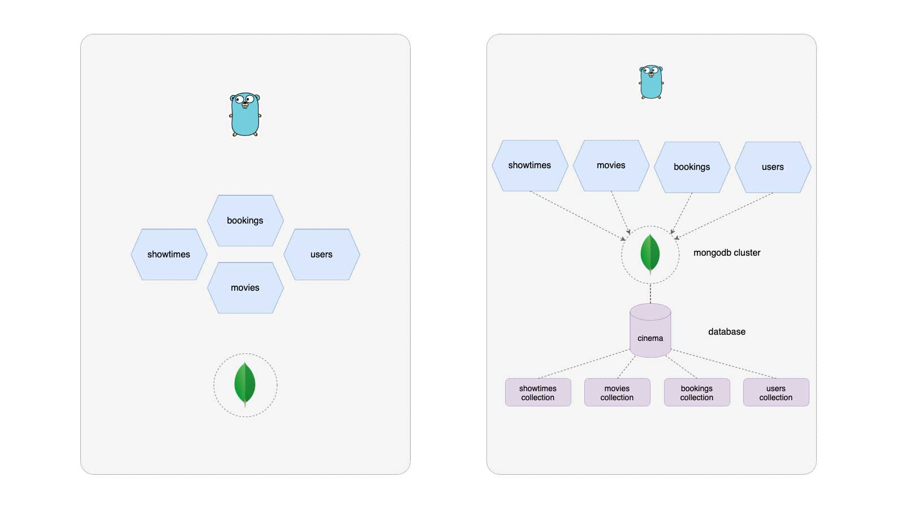

# Cinema - Example of Microservices in Go with Docker and MongoDB

## Overview

Cinema is an example project which demonstrates the use of microservices for a fictional movie theater.
The Cinema backend is powered by 4 microservices, all of witch happen to be written in Go, using MongoDB for manage the database and Docker to isolate and deploy the ecosystem.

 * Movie Service: Provides information like movie ratings, title, etc.
 * Show Times Service: Provides show times information.
 * Booking Service: Provides booking information.
 * Users Service: Provides movie suggestions for users by communicating with other services.

The Cinema use case is based on the project written in Python by [Umer Mansoor](https://github.com/umermansoor/microservices).

The proyect structure is based in the knowledge learned in:

* Golang structure: <https://peter.bourgon.org/go-best-practices-2016/#repository-structure>
* Book Let's Go: <https://lets-go.alexedwards.net/>

## Index

* [Overview](#overview)
    * [Deployment](#deployment)
    * [How To Use Cinema Services](#how-to-use-cinema-services)
    * [Significant Revisions](#significant-revisions)
    * [The big picture](#the-big-picture)
* [Localhost (docker-compose)](./docs/localhost.md#overview)
    * [Requirements](./docs/localhost.md#requirements)
    * [Starting services](./docs/localhost.md#starting-services)
    * [Restore database information](./docs/localhost.md#restore-database-information)
    * [Stoping services](./docs/localhost.md#stoping-services)
    * [Traefik Proxy dashboard](./docs/localhost.md#traefik-proxy-dashboard)
    * [Build from souce code](./docs/localhost.md#build-from-souce-code)

## Deployment

The application can be deployed in both environments: **local machine** or in a **kubernetes cluster**. You can find the appropriate documentation for each case in the following links:

* [local machine (docker compose)](./docs/localhost.md)
* [kubernetes](./docs/kubernetes.md)

## How To Use Cinema Services

* [endpoints](./docs/endpoints.md)

## Significant Revisions

* [Microservices - Martin Fowler](http://martinfowler.com/articles/microservices.html)
* [Umer Mansoor - Cinema](https://github.com/umermansoor/microservices)
* [Traefik Proxy Docs](https://doc.traefik.io/traefik/)
* [MongoDB Driver for Golang](https://github.com/mongodb/mongo-go-driver)
* [MongoDB Golang Channel](https://www.youtube.com/c/MongoDBofficial/search?query=golang)

## The big picture

