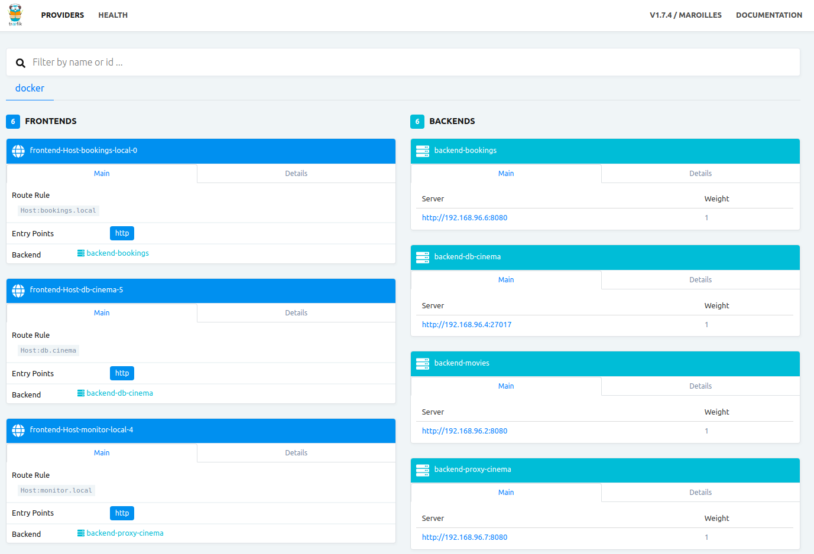

# Cinema - Example of Microservices in Go with Docker and MongoDB

Overview
========

Cinema is an example project which demonstrates the use of microservices for a fictional movie theater.
The Cinema backend is powered by 4 microservices, all of witch happen to be written in Go, using MongoDB for manage the database and Docker to isolate and deploy the ecosystem.

 * Movie Service: Provides information like movie ratings, title, etc.
 * Show Times Service: Provides show times information.
 * Booking Service: Provides booking information. 
 * Users Service: Provides movie suggestions for users by communicating with other services.

The Cinema use case is based on the project written in Python by [Umer Mansoor](https://github.com/umermansoor/microservices).

The proyect structure is based in the knowledge learned in the book: Web
Development with Go by Shiju Varghese, ISBN 978-1-4842-1053-6

[Full multilanguage documentation with screenshots here.](http://mmorejon.github.io/en/blog/microservices-example-with-docker-go-and-mongodb/)

Requirements
===========

* Docker 18.06.1-ce
* Docker Compose 1.23.1

We must **add virtual domains** in order to use each **api entry point**. By default we are using: **movies.local**, **bookings.local**, **users.local**, **showtimes.local** and **monitor.local**

**Virtual domains** has been defined in `docker-compose.yml` file and configured in `/etc/hosts` file. Add the following line in your `/etc/hosts` file:

```
127.0.0.1   movies.local bookings.local users.local showtimes.local monitor.local
```

**monitor.local** will be used to see the Dashboard created by Traefik.

Starting services
==============================

```
docker-compose up -d
```

Stoping services
==============================

```
docker-compose stop
```

Including new changes
==============================

If you need change some source code you can deploy it typing:

```
docker-compose build
```

Restore database information
======================

You can start using an empty database for all microservices, but if you want you can restore a preconfigured data execute this step:

**_Restore mongodb data typing:_**

This command will go inside the mongodb container (`db` service described in `docker-compose.yml` file) and will execute the script `restore.sh` located in `/backup/restore.sh`. Once the script finished the data inserted will be ready to be consulted.

```
docker-compose exec db /bin/bash /backup/restore.sh
```

Documentation
======================

## User Service

This service returns information about the users of Cinema.

**_Routes:_**

* GET - http://users.local/users : Get all users
* POST - http://users.local/users : Create user
* DELETE - http://users.local/users/{id} : Remove user by id

## Movie Service

This service is used to get information about a movie. It provides the movie title, rating on a 1-10 scale, director and other information.

**_Routes:_**

* GET - http://movies.local/movies : Get all movies
* POST - http://movies.local/movies : Create movie
* GET - http://movies.local/movies/{id} : Get movie by id
* DELETE - http://movies.local/movies/{id} : Remove movie by id

## Showtimes Service

This service is used get a list of movies playing on a certain date.

**_Routes:_**

* GET - http://showtimes.local/showtimes : Get all showtimes
* POST - http://showtimes.local/showtimes : Create showtime
* GET - http://showtimes.local/showtimes/{id} : Get showtime by id
* DELETE - http://showtimes.local/showtimes/{id} : Remove showtime by id

## Booking Service

Used to lookup booking information for users.

**_Routes:_**

* GET - http://bookings.local/bookings : Get all bookings
* POST - http://bookings.local/bookings : Create booking

Traefik Dashboard
======================

Access to the dashboard to see how Traefik organize the links.

* http://monitor.local : Get Traefik dashboard



### Significant Revisions

* [Microservices - Martin Fowler](http://martinfowler.com/articles/microservices.html)
* [Web Development with Go](http://www.apress.com/9781484210536)
* [Umer Mansoor - Cinema](https://github.com/umermansoor/microservices)
* [Traefik](https://traefik.io/)