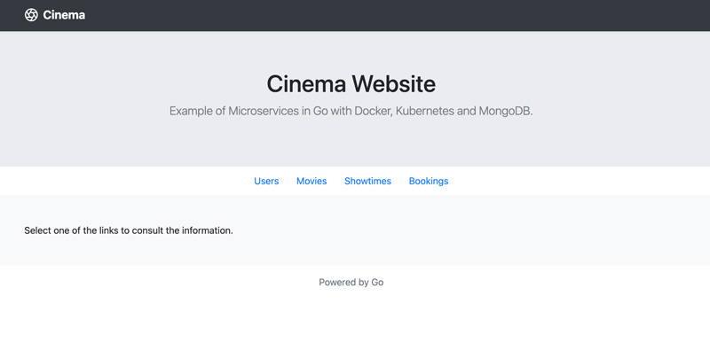
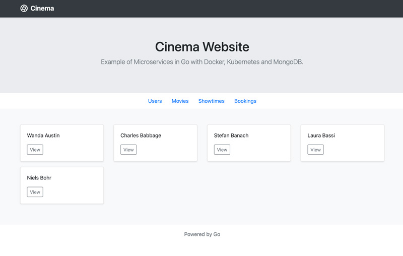
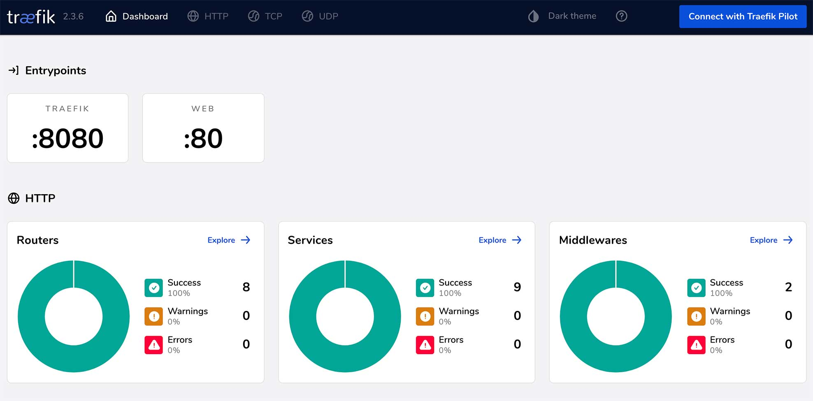

# Cinema - Localhost Deployment

## Overview

The Cinema project can be deployed in a single machine (localhost) using docker compose in order to know the behavior of microservices.

## Index

* [Localhost (docker-compose)](#overview)
* [Requirements](#requirements)
* [Starting services](#starting-services)
* [Restore database information](#restore-database-information)
* [Enabling microservices APIs](#enabling-microservices-apis)
* [Stoping services](#stoping-services)
* [Traefik Proxy dashboard](#traefik-proxy-dashboard)
* [Build from souce code](#build-from-souce-code)

## Requirements

* Docker Engine  20.10.0
* Docker Compose 1.27.4

## Starting services

Use the following command to deploy all services in your local environment.

```bash
$ docker-compose up -d

Creating microservices-docker-go-mongodb_showtimes_1 ... done
Creating microservices-docker-go-mongodb_db_1        ... done
Creating microservices-docker-go-mongodb_proxy_1     ... done
Creating microservices-docker-go-mongodb_website_1   ... done
Creating microservices-docker-go-mongodb_users_1     ... done
Creating microservices-docker-go-mongodb_movies_1    ... done
Creating microservices-docker-go-mongodb_bookings_1  ... done
```

```bash
$ docker-compose ps

                   Name                                  Command               State                     Ports
---------------------------------------------------------------------------------------------------------------------------------
microservices-docker-go-mongodb_bookings_1    ./cinema-bookins -mongoURI ...   Up
microservices-docker-go-mongodb_db_1          docker-entrypoint.sh mongod      Up      27017/tcp
microservices-docker-go-mongodb_movies_1      ./cinema-movies -mongoURI  ...   Up
microservices-docker-go-mongodb_proxy_1       /entrypoint.sh --api=true  ...   Up      0.0.0.0:80->80/tcp, 0.0.0.0:8080->8080/tcp
microservices-docker-go-mongodb_showtimes_1   ./cinema-showtimes -mongoU ...   Up
microservices-docker-go-mongodb_users_1       ./cinema-users -mongoURI m ...   Up
microservices-docker-go-mongodb_website_1     ./cinema-website -usersAPI ...   Up
```

Once the services have started, you can access the web through the following link: <http://localhost>.



## Restore database information

You will start using an empty database for all microservices, but if you want you can restore a preconfigured data execute this command:

```bash
$ docker-compose exec db mongorestore --uri mongodb://db:27017 --gzip  /backup/cinema

2021-01-18T19:10:35.914+0000    preparing collections to restore from
2021-01-18T19:10:36.016+0000    reading metadata for movies.movies from /backup/cinema/movies/movies.metadata.json.gz
2021-01-18T19:10:36.089+0000    reading metadata for showtimes.showtimes from /backup/cinema/showtimes/showtimes.metadata.json.gz
2021-01-18T19:10:36.143+0000    reading metadata for users.users from /backup/cinema/users/users.metadata.json.gz
2021-01-18T19:10:36.178+0000    reading metadata for bookings.bookings from /backup/cinema/bookings/bookings.metadata.json.gz
2021-01-18T19:10:36.236+0000    restoring bookings.bookings from /backup/cinema/bookings/bookings.bson.gz
2021-01-18T19:10:36.308+0000    no indexes to restore
2021-01-18T19:10:36.314+0000    finished restoring bookings.bookings (2 documents, 0 failures)
2021-01-18T19:10:36.467+0000    restoring movies.movies from /backup/cinema/movies/movies.bson.gz
2021-01-18T19:10:36.883+0000    no indexes to restore
2021-01-18T19:10:36.888+0000    finished restoring movies.movies (6 documents, 0 failures)
2021-01-18T19:10:36.894+0000    restoring showtimes.showtimes from /backup/cinema/showtimes/showtimes.bson.gz
2021-01-18T19:10:36.955+0000    no indexes to restore
2021-01-18T19:10:36.960+0000    finished restoring showtimes.showtimes (3 documents, 0 failures)
2021-01-18T19:10:36.989+0000    restoring users.users from /backup/cinema/users/users.bson.gz
2021-01-18T19:10:37.067+0000    no indexes to restore
2021-01-18T19:10:37.072+0000    finished restoring users.users (5 documents, 0 failures)
2021-01-18T19:10:37.075+0000    16 document(s) restored successfully. 0 document(s) failed to restore.
```

This command will go inside the mongodb container (`db` service described in `docker-compose.yml` file). Once the command finished the data inserted will be ready to be consulted. Try listing users againg <http://localhost/users/list>.



## Enabling microservices APIs

The microservices are not exposed to ensure greater security, but if you need to enable them for testing you can do so through the tags defined by Trafik for the Docker provider.

```yaml
    labels:
      # Enable public access
      - "traefik.http.routers.users.rule=PathPrefix(`/api/users/`)"
      - "traefik.http.services.users.loadbalancer.server.port=4000"
```

Once exposed all services the following links will be availables:

| Service | Description |
|---------|-------------|
| [Traefik Proxy Dashboard](http://localhost:8080/dashboard/#/) | Allows you to identify Traefik componentes like routers, provider, services, middlewares among others |
| [List users api](http://localhost/api/users/) | List all users |
| [List movies api](http://localhost/api/movies/) | List all movies |
| [List showtimes api](http://localhost/api/showtimes/) | List all showtimes |
| [List bookings api](http://localhost/api/bookings/) | List all bookings |

The following command is an example of how to list the users:

```bash
$ curl -X GET http://localhost/api/users/

[{"ID":"600209d347932ef15c50af15","Name":"Wanda","LastName":"Austin"},{"ID":"600209d347932ef15c50af16","Name":"Charles","LastName":"Babbage"},{"ID":"600209d347932ef15c50af17","Name":"Stefan","LastName":"Banach"},{"ID":"600209d347932ef15c50af18","Name":"Laura","LastName":"Bassi"},{"ID":"600209d347932ef15c50af19","Name":"Niels","LastName":"Bohr"}]
```

## Stoping services

```bash
$ docker-compose stop

Stopping microservices-docker-go-mongodb_proxy_1     ... done
Stopping microservices-docker-go-mongodb_users_1     ... done
Stopping microservices-docker-go-mongodb_movies_1    ... done
Stopping microservices-docker-go-mongodb_db_1        ... done
Stopping microservices-docker-go-mongodb_bookings_1  ... done
Stopping microservices-docker-go-mongodb_website_1   ... done
Stopping microservices-docker-go-mongodb_showtimes_1 ... done
```

## Traefik Proxy dashboard

This project use Traefik Proxy v2.4.2, [the dashboard should look like this image](http://localhost:8080/dashboard/#/):



Next: [Endpoints](endpoints.md)

## Build from souce code

If you want to include new functionalities, fix bugs or do some tests use the source code to build the docker image from the docker compose file. To make it uncomment the `build` line in de microservice and comment the `image` line.

```yaml
  users:
    build: ./users                                   # uncomment this line
    # image: ghcr.io/mmorejon/cinema-users:v2.1.0    # comment this line
    command:
      - "-mongoURI"
      - "mongodb://db:27017/"
    #   - "-enableCredentials"
    #   - "true"
    # environment:
    #   MONGODB_USERNAME: "demo"
    #   MONGODB_PASSWORD: "e3LBVTPdlzxYbxt9"
    labels: {}
      # Enable public access
      # - "traefik.http.routers.users.rule=PathPrefix(`/api/users/`)"
      # - "traefik.http.services.users.loadbalancer.server.port=4000"
```